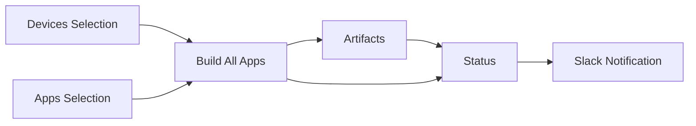
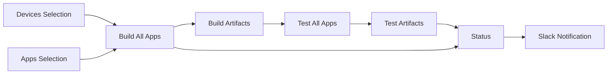
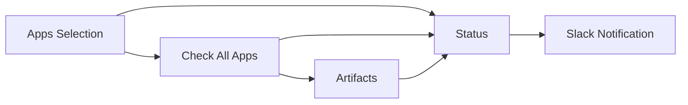
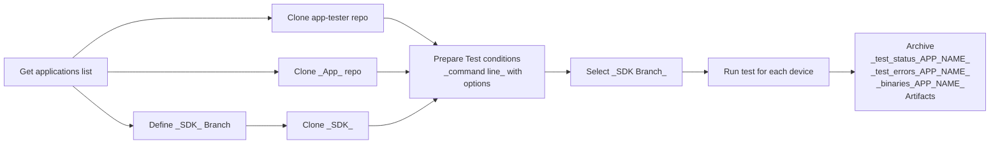
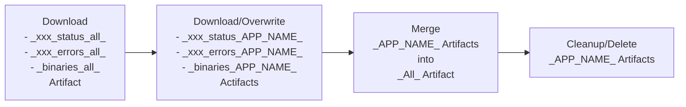
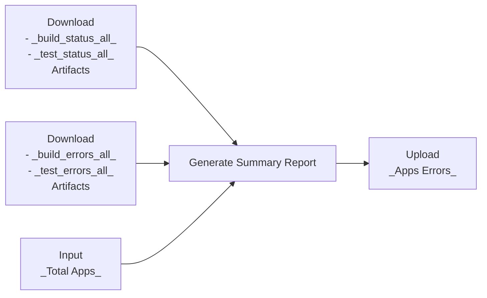
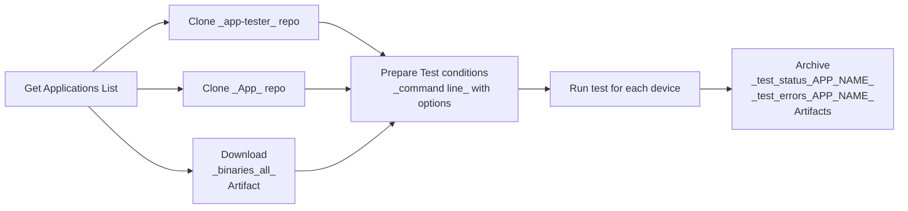
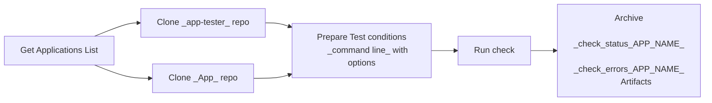

# Workflows Internals

This document explains the internal mechanism used in the different workflows.

## Overview

Each top level workflow is split into smaller internal ones, to facilitate the reuse, and the readability.

### Build & Scan Workflows

The Simple Build consist in the following sequence:



> **Note**: The Scan workflow only differ with _Flags_ or _Title_ elements.

### Test Workflow

The Simple Test consist in the following sequence:



### Check Workflow

The Simple Check consist in the following sequence:



### Devices Selection

Each devices to target is initialized with the following steps:

1. If the workflow trigger is _schedule_ or _pull_request_, select all available devices.
2. Else, if the input parameters target a device, then select it.
3. This is computed thanks to:
    - [_setup_devices.yml](../.github/workflows/_setup_devices.yml), calling that dedicated script
    - [setup_devices.py](../scripts/setup_devices.py), allowing to correctly format the devices list
      and automatically set the appropriate variable in `GITHUB_OUTPUT`.

### Apps Selection

Here, we define which apps we want/need to test, and against which SDK.  
Also, some configurations are possible thanks to environment variables:

- `WHITELIST`
- `BLACKLIST`
- `DEFAULT_SDK`

This results are set in the appropriate variables in `GITHUB_OUTPUT`.
Those variables can then be used as input parameters for other jobs or child workflows.

## Building All Apps

Building the Apps is done thanks to a dedicated internal workflow [_build_app.yml](../.github/workflows/_build_app.yml).
This workflow uses the following input parameters:

- `mode`: Indicate if we are in _build_, _scan_ or _test_.
- `sdk_branch`: The SDK branch to build against.
- `sdk_type`: The type of SDK the apps use (`C` or `Rust`).
- `devices`: The list of targeted devices.
- `exclude_apps`: List of application names to exclude from the build.
- `only_apps`: List of application names to include in the build.
- `with_variants`: Request to build all known variants.

Here again, some environment variables can be set:

- `BLACKLIST`
- `LIMIT`

This workflow returns the following output value:

- `total_apps`: Total number of selected Apps

### Apps List

The first step is to generate the real App list, considering the different input parameters and env variables.
This step is executed by [parse_all_apps.py](../scripts/parse_all_apps.py),
which will retrieve the Apps list from GitHub, using the predefined filters.
The result is a Json data which looks like:

```json
[
  {
    repo_name: app-boilerplate,
    sdk: c,
    devices: [flex, nanos+, nanox, stax],
    build_directory: ./,
    variant_param: COIN,
    COIN, variants_values: [BOL]
  }
]
```

> **Note**: The filters allow to exclude Apps that are _Private_, _Archived_ or _Legacy_.

Finally, the Json data file is uploaded as a GitHub artifact under the name `apps_config`.

### Building Operation

Now that we know which App have to be compiled, we can go ahead with the next step.  
Of course, the build operation is executed inside the docker container `ledger-app-builder`.



After cloning the different elements (App, SDK, app-tester),
the build operation is delegated to [build_app.sh](../scripts/build_app.sh).

> **Note**: The selected devices are all compiled one after the other in the same job.

The build status are concatenated in a dedicated file, named `build_status_<app_name>.md`.  
In case of error, incriminated devices are written, with the App name,
in a dedicated file named `build_errors_<app_name>.md`.

At the end, all those files are uploaded as GitHub artifacts.

Finally, if the input parameter `mode` is `test`,
the file tree of the different `app.elf` per device, under `build/` directory,
is uploaded as a GitHub artifact named `binaries_<app_name>`.

### Collecting Artifacts

After the Build (or Test) operation, the artifacts are cleaned up.
Instead of keeping a multitude of individual files (suffixed by the App Name), they are collected
in archive per type.



This operation is done by a dedicated internal workflow [_artifacts.yml](../.github/workflows/_artifacts.yml).
The steps consist in:

- Merging the different `build_status_<app_name>.md` into a unique archive `build_status_all`.
- Merging the different `build_errors_<app_name>.md` into a unique archive `build_errors_all`.
- Merging the different `binaries_<app_name>` into a unique archive `binaries_all`.

Also, for the Test:

- Merging the different `test_status_<app_name>.md` into a unique archive `test_status_all`.
- Merging the different `test_errors_<app_name>.md` into a unique archive `test_errors_all`.

> **Note**: To avoid printing useless errors when artifacts are not available (like errors),
there is a special step to check if the artifacts exist.

### Generating Status

Once the previous operations are completed, the next operation consists in generating the summary report.



This is done by a dedicated internal workflow [_status.yml](../.github/workflows/_status.yml).
This workflow uses a single input parameter:

- `mode`: Indicate if we are in _build_ or _test_.
- `job_name`: Substring to check in jobs to get the URL (_Build_ or _Scan_).
- `total_apps`: Total number of tested Apps.
- `exclude_apps`: List of excluded Apps.
- `with_variants`: Request to build all known variants.

After cloning the app-tester and installing few dependencies, the following steps are executed:

1. Download the artifact `build_status_all`.
2. Download the artifact `build_errors_all`.
3. Generate the summary report, done by [summary.py](../scripts/summary.py).
4. If any file `build_errors_<app_name>.md` exist, upload `apps_errors` as a GitHub artifact.
   This file is in fact generated along within the summary report in previous step.
   This file will be used later to generate the Slack message.

### Slack Notification

Last step of the operations is to notify the result / status on Slack.

This is done in 2 steps:

- Prepare the Slack message
- Send the Slack message

> **Note**: This split is due to a limitation: we cannot use the _webhook_ secret in a reusable workflow.

The preparation is then done by a dedicated internal workflow [_slack_message.yml](../.github/workflows/_slack_message.yml).
This workflow uses different input parameters:

- `title`: Title of the message.
- `devices`: The list of analyzed devices.
- `total_apps`: Total number of tested Apps.

After cloning the app-tester and installing few dependencies, the following steps are executed :

1. Check if the artifact `apps_errors` exist, and download it.
2. Convert the different elements to a Json data thanks to [slack_message.py](../scripts/slack_message.py).
3. Upload the Slack message file for next step (sending).

Then, the sending is done from the top level workflow, conditioned by either:

- Schedule triggering
- Manual triggering, with the parameter `send_to_slack`

## Scanning All Apps

The Apps scanning operation consists in building a set of Apps,
with dedicated extra flags (`ENABLE_SDK_WERROR=1 scan-build`).

Thus, the list of operations is the same as described in [Building All Apps](#building-all-apps)

## Testing All Apps

The Apps testing operation consists in building a set of Apps, and executing the _ragger_ tests
for each of them (and for each device).



The operations are very close to what is done for [Building All Apps](#building-all-apps). The differences are:

- Storing the artifacts during the Build (thanks to the parameter `mode`).
- Executing the _ragger_ tests themselves after the Build

Thus, that means other operations are the same as the _Build_ case, and won't be detailed again here:

- Artifacts collection
- Status Generation
- Slack notification

These operations are performed by [_test_app.yml](../.github/workflows/_test_app.yml).

### Apps List

Contrary to the _Build_ operation, here, we won't parse GitHub to find the Apps list,
but we'll rather use the list of Apps that have been selected and built.

### Testing Operation

After cloning the app-tester and installing few dependencies, the test operation is delegated to [test_app.sh](../scripts/test_app.sh).
In the workflow, the following steps are executed:

1. Download the artifact `binaries_<app_name>` containing the different `app.elf` for each device.
2. Determine the device list (based on the downloaded artifact in previous step).
3. Execute the tests

> **Note**: The selected devices are all tested one after the other in the same job.

The test status are concatenated in a dedicated file, named `test_status_<app_name>.md`.  
In case of error, incriminated devices are written in a dedicated file, named `test_errors_<app_name>.md`.

All those files are then uploaded as GitHub artifacts.

## Checking All Apps

The Apps checking operation consists in calling the _Guideline Enforcer_ script
(available in the docker container), on a set of Apps.



The operations are thanks to a dedicated internal workflow [_check_app.yml](../.github/workflows/_check_app.yml).
This workflow uses the following input parameters:

- `exclude_apps`: List of application names to exclude from the build.
- `only_apps`: List of application names to include in the build.

Here again, some environment variables can be set:

- `WHITELIST`
- `BLACKLIST`
- `LIMIT`

This workflow returns the following output value:

- `total_apps`: Total number of selected Apps

### Apps List

This step is similar to the one done in the _Build_ operation.

### Checking Operation

After cloning the app-tester, the check operation is delegated to [check_app.sh](../scripts/check_app.sh).
In the workflow, the following steps are executed:

1. Define the Apps list.
2. Execute the checks

The check status is stored in a dedicated file, named `check_status_<app_name>.md`.  
In case of error, incriminated App is written in a dedicated file, named `check_errors_<app_name>.md`.

All those files are then uploaded as GitHub artifacts.
